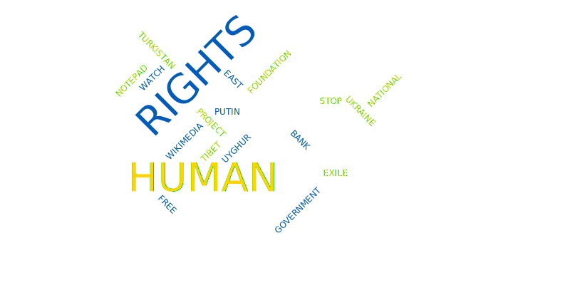

# Promoting Human Rights: A Collection of Organizations I Support



[](https://opensource.org/licenses/MIT)


This project displays a list of NGOs, human rights groups, and other organizations I support.

As a big believer in the importance of human rights, I want to share the
organizations that I have donated to.


## Usage

```
$ git clone https://github.com/leeway64/promoting-human-rights-a-collection-of-organizations-I-support.git
$ cd promoting-human-rights-a-collection-of-organizations-I-support.git
$ ghc --make include/Main.hs include/Organizations.hs -o bin/Main
$ ./bin/Main


********************************************************************************
Promoting Human Rights: A Collection of Organizations I Support

This project displays a list of NGOs, human rights groups, and other organizations I support.

As a big believer in the importance of human rights, I want to share the
organizations that I have donated to.

Type "next" to get started!
next

********************************************************************************
Stop Putin
	Stand with Ukraine!
	Support the fight against Russia by visiting https://www.stopputin.net/ and donating to a fund.
	Down with Vladimir Putin and Xi Jinping!

Type "next" to continue.

    ...

```


## Links

A list of all the sources mentioned in this project can be viewed by running the `references`
Docker container.

```
$ sudo docker build -t references ./include
$ sudo docker run references


Collected here are the references/links mentioned in this project

Stop Putin
	Down with Vladmir Putin and Xi Jinping!
		stopputin.net

National Bank of Ukraine
	Support the Ukrainian Armed Forces:
		https://bank.gov.ua/en/news/all/natsionalniy-bank-vidkriv-spetsrahunok-dlya-zboru-koshtiv-na-potrebi-armiyi

	Support the humanitarian relief effort:
		https://bank.gov.ua/en/news/all/natsionalniy-bank-vidkriv-rahunok-dlya-gumanitarnoyi-dopomogi-ukrayintsyam-postrajdalim-vid-rosiyskoyi-agresiyi

    ...

```

For more information on how Docker works, refer to [this page](doc/docker/README.md).


## Documentation

You can also view all of this project's content through Sphinx-generated documentation.

To build the `html` file, run the following commands:

```
python3 -m venv .venv
source .venv/bin/activate
pip install -r requirements.txt
sphinx-build -b html doc/source doc/build
open doc/build/index.html
```

`sphinx-build` will also build the project word cloud into the `doc/build/_images` folder.


## Third-party tools

- [Sphinx](https://github.com/sphinx-doc/sphinx) (BSD license): Documentation generator.
  - [sphinxcontrib-kroki](https://pypi.org/project/sphinxcontrib-kroki/) (MIT License): Allows for
    diagrams to be embedded into Sphinx documentation using Kroki. sphinxcontrib-kroki created the
    Vega word cloud at the start of this document.
  - [furo](https://pypi.org/project/furo/) (MIT License): Sphinx documentation theme.
- [Kroki](https://kroki.io/) (MIT License): Provides a simple way of drawing a variety of
  different types of diagrams (e.g.: PlantUML, BlockDiag).
- [Docker](https://www.docker.com/) (Apache-2.0 License): Packages software into independent containers.


## License

The content of this project is licensed under the [Creative Commons Attribution 4.0 
International license (CC-BY-4.0)](LICENSE.txt).

To learn more about the CC-BY-4.0 license, refer to
[this Creative Commons page](https://creativecommons.org/licenses/by/4.0/).
To use the CC-BY-4.0 license in your own project, refer to this page on
[choosealicense.com](https://choosealicense.com/licenses/cc-by-4.0).

The source code used to format and display the content (e.g., the Haskell, Python, and Docker code)
is licensed under the [MIT License](LICENSE-CODE.txt).

